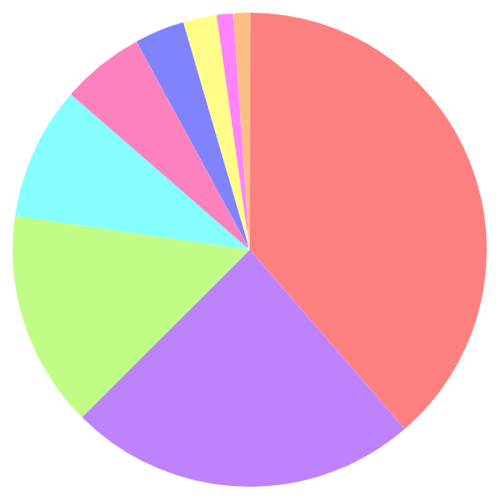

# Pie Chart

Sample implementation of pie chart using [SVG](https://package.elm-lang.org/packages/elm/svg/latest/) in Elm 0.19.

Imspired by [https://ksk-soft.com/2014/08/06/svg-pie-graph/](https://ksk-soft.com/2014/08/06/svg-pie-graph/).

## ScreenShot

## License

MIT © [hahnah](https://superhahnah.com)